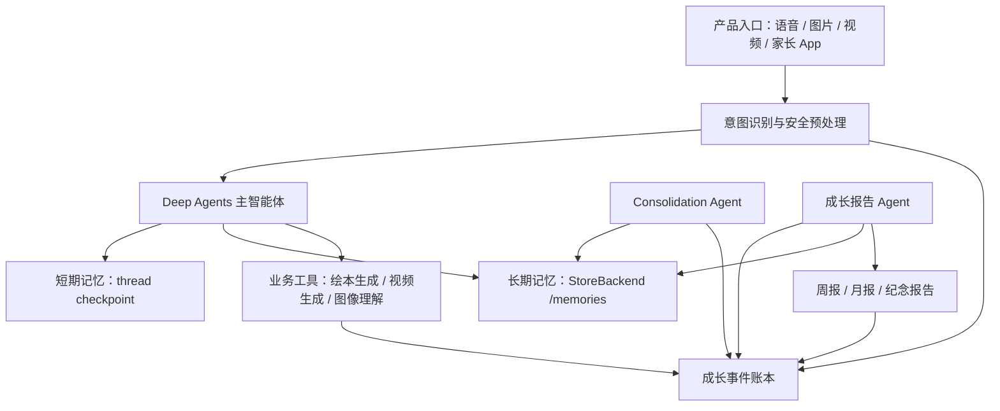

# Deep Agents 记忆机制与成长轨迹设计文档

> 状态：设计稿，不包含代码改动。
> 适用项目：`content-builder-agent`
> 参考文档：
> - LangChain Deep Agents Memory: https://docs.langchain.com/oss/python/deepagents/memory
> - LangChain Deep Agents Context Engineering: https://docs.langchain.com/oss/python/deepagents/context-engineering
> - LangGraph Persistence: https://docs.langchain.com/oss/python/langgraph/persistence
> - LangChain Long-term Memory: https://docs.langchain.com/oss/python/langchain/long-term-memory

## 1. 背景与目标

当前项目已经使用 Deep Agents 作为智能体编排底座，入口集中在 `content_builder/agent_factory.py`。现状是：

- 主智能体通过 `create_deep_agent()` 创建。
- 短期对话记忆使用 `MemorySaver()`，只能在单进程内按 `thread_id` 保存上下文。
- backend 当前支持 `filesystem`、`local_shell`、`remote`，实际配置中使用 `local_shell`。
- `main_agent.yaml` 中只配置了 `/AGENTS.md` 作为 memory，尚未配置用户级长期记忆。
- 尚未建立成长事件账本，因此图片上传、绘本生成、视频生成、亲子共创等业务事件无法稳定汇总为成长轨迹报告。

本设计目标是建立一套可落地的记忆与成长数据架构：

- 不同用户之间长期记忆隔离。
- 同一用户不同会话之间短期记忆隔离，但长期记忆共享。
- 成长轨迹报告能读取产品内所有关键操作记录。
- 个性化画像能沉淀为长期记忆，并反哺智能体回答风格、内容推荐和亲子建议。

## 2. Deep Agents 记忆机制

Deep Agents 的记忆可以分为三层：短期记忆、长期记忆、文件化记忆接口。

### 2.1 短期记忆：thread-scoped state/checkpoint

短期记忆由 LangGraph checkpointer 管理。每个会话通过 `thread_id` 区分：

```text
thread_id = 一个会话的短期上下文边界
```

同一个 `thread_id` 下，LangGraph 会保存：

- 对话消息历史。
- 工具调用和工具返回。
- graph state。
- Deep Agents `StateBackend` 中的临时文件。
- 中断、恢复、时间旅行等运行状态。

不同 `thread_id` 之间默认隔离。也就是说，同一个用户开两个新会话，只要使用不同 `thread_id`，两个会话就不会共享短期上下文。

当前项目使用 `MemorySaver()`，它适合本地 demo：

- 优点：接入简单。
- 缺点：只在当前进程内保存，进程重启后短期记忆丢失。

生产环境应替换为持久化 checkpointer，例如 Postgres checkpointer 或 LangGraph Platform/Agent Server 自动管理的 checkpoint。

### 2.2 长期记忆：Store/namespace

长期记忆由 LangGraph Store 管理。它和短期记忆的核心区别是：

```text
短期记忆按 thread_id 隔离。
长期记忆按 namespace 隔离。
```

Store 的数据结构可以理解为：

```text
namespace: tuple[str, ...]
key: string
value: JSON document
```

例如：

```text
namespace = ("users", "user_123", "agent_memory")
key = "/memories/profile.md"
value = { ...file data... }
```

长期记忆可以跨会话读取，因此同一个用户的多个 `thread_id` 能共享同一份用户画像、兴趣趋势和互动偏好。

本地开发可使用 `InMemoryStore`；生产环境必须使用 DB-backed store，例如 PostgresStore、RedisStore、MongoDBStore，或者由 LangGraph Platform 托管。

### 2.3 Deep Agents 文件化记忆：Backend routing

Deep Agents 给智能体暴露了虚拟文件系统工具，例如：

- `ls`
- `read_file`
- `write_file`
- `edit_file`
- `glob`
- `grep`

默认 `StateBackend` 中的文件属于短期记忆，只存在于当前 thread。若希望某些文件跨会话持久化，需要使用 `CompositeBackend`：

```text
default backend -> StateBackend       # 会话内临时文件
/memories/      -> StoreBackend       # 用户级长期记忆
/policies/      -> StoreBackend       # 组织级只读策略
```

这样智能体可以像读写文件一样维护长期记忆：

```text
/memories/profile.md
/memories/interests.md
/memories/interaction_style.md
/memories/report_context.md
```

关键点是：只有匹配 `/memories/` 路由前缀的文件才会进入 StoreBackend。写到 `/draft.md`、`/analysis/foo.md` 等路径的文件仍然是短期或本地工作文件。

## 3. 记忆类型与推荐用途

长期记忆不要当作原始日志库使用。它应该保存“压缩后的、有助于智能体下一次决策的信息”。

### 3.1 Semantic memory：语义记忆

用于保存稳定事实、偏好、画像和趋势。

适合保存：

- 孩子年龄段和语言表达特点。
- 孩子喜欢的主题，例如动物、太空、恐龙、建筑、身体、情绪。
- 孩子不喜欢或害怕的元素。
- 适合孩子的解释风格。
- 家长对内容、语气、教育目标的偏好。
- 最近高频兴趣和长期兴趣变化。

推荐文件：

```text
/memories/profile.md
/memories/interests.md
/memories/interaction_style.md
/memories/parenting_preferences.md
/memories/safety_notes.md
```

### 3.2 Episodic memory：情节记忆

用于保存“发生过什么”的经历。成长轨迹报告非常依赖这一层，但不建议把所有经历直接塞入 `/memories/*.md`。

正确做法是：

- 原始经历进入业务事件账本。
- 重要经历可以被 consolidation agent 摘要成长期记忆。
- 报告生成 agent 通过工具检索事件账本，而不是只读 markdown memory。

例如：

```text
孩子在 5 月 10 日上传蜗牛照片，并问“它为什么背着房子？”
系统生成了《慢慢侠的雨天冒险》绘本。
家长参与了“勇敢回家”的故事主题选择。
```

这些事实应先进入事件账本，再由总结流程抽取为：

```text
孩子最近持续关注“动物的家”和“保护自己”的主题。
```

### 3.3 Procedural memory：程序记忆

用于保存智能体应该如何工作的规则。

适合放在：

- `AGENTS.md`
- skills
- 组织级只读 memory
- `/policies/child_safety.md`

不建议让普通用户输入直接改写程序记忆，避免 prompt injection 和跨用户污染。

## 4. 总体架构

推荐采用三件套：

```text
用户级长期记忆 + 会话级短期记忆 + 业务事件账本
```

架构图：



关键边界：

- `thread_id` 只决定短期会话。
- `user_id`、`child_id`、`family_id` 决定长期数据归属。
- `/memories/*.md` 是智能体常用的压缩记忆。
- 成长事件账本是报告和画像的事实来源。

## 5. 用户级长期记忆设计

### 5.1 Namespace 设计

单智能体版本：

```text
("users", user_id, "agent_memory")
```

多智能体版本：

```text
(assistant_id, "users", user_id, "agent_memory")
```

如果产品中一个家长账号下有多个孩子，应进一步隔离到 child 维度：

```text
("families", family_id, "children", child_id, "agent_memory")
```

推荐最终采用 child 维度，因为成长轨迹、兴趣画像和内容建议主要围绕孩子，而不是围绕登录用户。

### 5.2 Memory 文件设计

#### `/memories/profile.md`

用途：总览孩子画像，保持短小。

建议结构：

```markdown
# Child Profile

## Basic Context
- Child ID:
- Age range:
- Primary language:
- Family role contacts:

## Current Summary
- ...

## Stable Preferences
- ...

## Important Cautions
- ...
```

#### `/memories/interests.md`

用途：记录兴趣主题、迁移路径和高频问题。

建议结构：

```markdown
# Interest Map

## Active Themes
- Theme:
  Evidence:
  Updated:

## Emerging Themes
- ...

## Fading Themes
- ...

## Representative Questions
- ...
```

#### `/memories/interaction_style.md`

用途：帮助智能体更贴合孩子。

建议结构：

```markdown
# Interaction Style

## Explanation Style
- ...

## Storytelling Style
- ...

## Emotional Support Style
- ...

## Avoid
- ...
```

#### `/memories/parenting_preferences.md`

用途：记录家长偏好、教育目标和参与方式。

建议结构：

```markdown
# Parenting Preferences

## Parent Goals
- ...

## Content Preferences
- ...

## Co-creation Habits
- ...

## Notification Preferences
- ...
```

#### `/memories/report_context.md`

用途：记录上次报告后的摘要状态，避免重复生成。

建议结构：

```markdown
# Report Context

## Last Weekly Report
- Report ID:
- Covered period:
- Highlights:

## Last Monthly Report
- Report ID:
- Covered period:
- Highlights:

## Open Threads
- ...
```

### 5.3 读写策略

默认策略：

- 主智能体可以读取 `/memories/`。
- 主智能体可以建议写入用户级 memory。
- 高风险信息写入需要标记来源和置信度。
- 组织级 `/policies/` 只读。

记忆写入分为两类：

- 热路径写入：对用户明确要求“记住”的偏好立即写入。
- 后台沉淀：由 consolidation agent 定时读取事件和会话，更新长期画像。

推荐先实现后台沉淀为主，热路径只处理明确偏好。这样能减少主对话延迟，也能提升记忆质量。

## 6. 短期记忆设计

### 6.1 thread_id 规则

每次新会话生成新的 `thread_id`：

```text
thread_id = session_id
```

或者：

```text
thread_id = "{user_id}:{session_id}"
```

注意：不要只用 `user_id` 当 `thread_id`，否则同一用户所有会话都会混在一起，无法满足“同一个用户不同会话短期记忆不一样”。

### 6.2 Runtime context

每次 invoke/stream 时传入运行上下文：

```text
user_id
child_id
family_id
session_id
role
consent_scope
source_device
```

这些字段不应默认暴露给模型；只有工具、middleware 或动态 prompt 需要时才读取。

### 6.3 Checkpointer

本地开发：

```text
MemorySaver
```

生产环境：

```text
Postgres checkpointer 或 LangGraph Platform 托管 checkpoint
```

验收标准：

- 相同 `thread_id` 能恢复会话。
- 不同 `thread_id` 不能看到对方短期消息。
- 服务重启后仍能恢复历史 thread。

## 7. 成长事件账本设计

长期记忆不是数据库，不能承担全部成长数据。应新增业务事件账本，保存所有可审计事实。

### 7.1 事件表字段

建议字段：

```text
event_id
family_id
child_id
user_id
session_id
thread_id
event_type
source_device
occurred_at
content_text
asset_refs
metadata_json
safety_labels
visibility
consent_scope
created_at
updated_at
```

字段说明：

- `event_id`：全局唯一 ID。
- `family_id`：家庭空间 ID。
- `child_id`：孩子 ID，成长报告主要按此维度生成。
- `user_id`：触发事件的用户，可能是孩子、父亲、母亲、祖辈或系统。
- `session_id`：产品会话 ID。
- `thread_id`：对应 LangGraph 短期会话 ID。
- `event_type`：事件类型。
- `source_device`：机器人、手环、家长 App、后台任务等。
- `content_text`：可被检索的文本摘要。
- `asset_refs`：图片、音频、视频、绘本、报告等资产引用，不直接存大文件。
- `metadata_json`：结构化扩展信息。
- `safety_labels`：安全分类、风险等级、审核结果。
- `visibility`：家长可见、仅系统可见、已删除等。
- `consent_scope`：授权范围。

### 7.2 事件类型

第一批建议支持：

```text
chat_message
curiosity_question
image_uploaded
image_understood
video_uploaded
story_started
story_completed
picture_book_generated
video_generated
parent_joined
emotion_signal
safety_alert
report_generated
memory_consolidated
```

### 7.3 事件写入原则

- 产品侧是主写入方，所有关键操作都应由后端直接写事件。
- Agent 工具也可以写事件，但不能作为唯一写入路径。
- 每次生成绘本、视频、报告，都必须写入产物事件。
- 图片、视频、语音只写 asset reference，不把二进制内容写入 memory。
- 删除数据时，事件账本、长期 memory、报告摘要和资产引用要一起处理。

## 8. 工具设计

### 8.1 `record_growth_event`

用途：写入成长事件。

参数建议：

```text
event_type: str
content_text: str | None
asset_refs: list[str]
metadata: dict
safety_labels: list[str]
visibility: str
```

工具内部从 runtime context 获取：

```text
user_id
child_id
family_id
session_id
thread_id
source_device
consent_scope
```

设计原则：

- 不允许模型手填 `user_id`、`child_id` 等身份字段。
- 工具应校验 event_type 白名单。
- 工具应自动补齐时间戳和审计信息。

### 8.2 `search_growth_events`

用途：按时间、类型、关键词检索成长事件。

参数建议：

```text
start_at: str | None
end_at: str | None
event_types: list[str]
query: str | None
limit: int
```

工具内部从 runtime context 限定 child/family 范围，防止跨用户检索。

### 8.3 `get_recent_artifacts`

用途：获取近期绘本、视频、图片、报告等产物。

参数建议：

```text
artifact_types: list[str]
start_at: str | None
end_at: str | None
limit: int
```

返回内容应包含：

```text
artifact_id
artifact_type
title
created_at
asset_ref
summary
linked_event_ids
```

### 8.4 `get_user_profile`

用途：读取当前孩子的结构化画像和 markdown 摘要。

数据来源：

- Store 中的 `/memories/profile.md`
- Store 中的结构化 profile JSON
- 事件账本中的近期摘要

### 8.5 `update_user_profile_summary`

用途：由 consolidation agent 更新长期画像摘要。

限制：

- 只允许后台 agent 或受信工具调用。
- 写入前保留 old version。
- 写入后记录 `memory_consolidated` 事件。

## 9. 智能体设计

### 9.1 主陪伴智能体

职责：

- 处理日常陪伴、问答、故事共创。
- 读取用户级长期 memory，让回答更贴合孩子。
- 对明确值得记录的事件调用 `record_growth_event`。
- 必要时委托给子智能体。

可见工具：

- 内容生成工具。
- 图像/视频理解工具。
- `record_growth_event`
- `search_growth_events` 的受限版本。
- `get_user_profile`

### 9.2 Growth Consolidation Agent

职责：

- 定时读取近期事件和近期会话。
- 抽取兴趣变化、表达变化、代表性问题、家长参与情况。
- 更新 `/memories/profile.md`、`/memories/interests.md`、`/memories/interaction_style.md`、`/memories/report_context.md`。
- 保持长期记忆简洁，不写流水账。

触发方式：

- 每日夜间。
- 每周报告生成前。
- 用户手动请求刷新画像时。

输入：

```text
child_id
family_id
time_window
```

输出：

```text
updated_memory_files
summary
evidence_event_ids
confidence
```

### 9.3 Growth Report Agent

职责：

- 生成周报、月报和特殊节点报告。
- 从事件账本读取完整事实。
- 从长期 memory 读取画像和趋势。
- 输出家长可读报告。
- 将报告摘要回写事件账本，并可更新 `/memories/report_context.md`。

报告内容建议：

- 本周期高频兴趣。
- 代表性童言童语。
- 图片/视频探索记录。
- 绘本和故事作品。
- 亲子共创参与情况。
- 情绪与表达变化。
- 下周期亲子陪伴建议。
- 安全与隐私提示。

### 9.4 Safety Guardian Agent

职责：

- 检查儿童内容安全。
- 标注高风险事件。
- 对敏感记忆写入提出确认要求。
- 生成家长提醒。

该 agent 读取 `/policies/child_safety.md`，但不允许修改。

## 10. 数据流设计

### 10.1 日常问答

```text
1. 用户输入语音/文本/图片。
2. 产品侧创建 session_id/thread_id，并传 runtime context。
3. 输入预处理和安全检测。
4. 主智能体读取短期 thread state。
5. 主智能体读取 `/memories/profile.md` 等长期记忆。
6. 主智能体生成回答。
7. 产品侧写入 chat_message / curiosity_question 等事件。
8. 如有必要，智能体调用 record_growth_event 补充结构化信息。
```

### 10.2 图片探索到绘本生成

```text
1. 孩子上传图片。
2. 产品侧写 image_uploaded 事件，asset_refs 指向图片。
3. 图像理解工具生成识别摘要。
4. 写 image_understood 事件。
5. 孩子继续提问，写 curiosity_question 事件。
6. 主智能体引导故事共创，写 story_started / story_completed。
7. 绘本生成工具产出绘本，写 picture_book_generated。
8. consolidation agent 后台归纳兴趣趋势。
```

### 10.3 周报生成

```text
1. 定时任务触发 Growth Report Agent。
2. Report Agent 检索本周成长事件。
3. Report Agent 读取长期画像和上次 report_context。
4. 生成报告正文。
5. 写 report_generated 事件。
6. 将报告摘要更新到 /memories/report_context.md。
```

### 10.4 个性化画像更新

```text
1. Consolidation Agent 定时运行。
2. 检索最近 N 天事件和关键会话。
3. 提炼稳定偏好、兴趣变化、表达变化。
4. 与旧 profile 合并。
5. 写入 /memories/profile.md 和相关 memory 文件。
6. 写 memory_consolidated 事件，记录 evidence_event_ids。
```

## 11. 安全与权限

### 11.1 隔离原则

默认使用 child/family scoped namespace。禁止使用全局可写长期记忆保存用户信息。

推荐隔离：

```text
孩子画像：("families", family_id, "children", child_id, "agent_memory")
家庭偏好：("families", family_id, "family_memory")
组织策略：("org", org_id, "policies")
```

### 11.2 只读策略

以下内容应只读：

- 儿童安全策略。
- 合规要求。
- 组织级提示词。
- 官方内容规范。

只读内容由应用代码或管理员后台维护，不由普通对话智能体直接写入。

### 11.3 高风险记忆

以下信息不能静默写入长期记忆：

- 健康和心理判断。
- 家庭敏感关系。
- 具体地理位置。
- 身份证件、学校、住址等个人敏感信息。
- 可能引发家长焦虑的推断。

处理方式：

- 先写事件账本并标注风险。
- 必要时请求家长确认。
- 长期 memory 中只保存谨慎、低风险、可解释的摘要。

### 11.4 删除与导出

家长端必须支持：

- 查看长期记忆摘要。
- 查看成长事件。
- 导出数据。
- 删除指定事件、资产、报告和长期画像。
- 一键删除孩子全部数据。

删除后，agent 的工具检索必须查不到对应数据。

## 12. 现有项目落地路径

此部分描述后续实现步骤，不代表本文档已经改代码。

### 阶段一：配置和上下文

目标：让 agent 每次调用都知道当前用户和孩子，但不改变业务行为。

建议改动：

- 新增 `RuntimeContext` dataclass。
- `stream_chat/chat_once` 支持传入 `user_id`、`child_id`、`family_id`、`session_id`。
- invoke/stream 时传 `context=RuntimeContext(...)`。
- 保持现有 `thread_id` 参数，但要求上层每个新会话生成新 `thread_id`。

验收：

- 不传 context 时仍能本地 demo。
- 传不同 `thread_id` 时短期上下文隔离。

### 阶段二：长期 StoreBackend

目标：支持 `/memories/` 用户级长期记忆。

建议改动：

- 配置层增加 memory backend 开关。
- 本地默认使用 `InMemoryStore`。
- 生产支持 PostgresStore 或平台托管 store。
- `_build_backend` 支持 `CompositeBackend`：
  - `default=StateBackend`
  - `routes={"/memories/": StoreBackend(namespace=...)}`。
- `create_deep_agent()` 传入 `store` 和 `context_schema`。

验收：

- 用户 A 写入 `/memories/profile.md` 后，用户 B 读取不到。
- 同用户 thread-1 写入后，thread-2 能读取。

### 阶段三：成长事件账本

目标：建立报告事实来源。

建议改动：

- 新增 `growth_events` 数据访问层。
- 新增 `record_growth_event` 工具。
- 在图片、绘本、视频、故事等工具完成后写事件。
- 对现有生成工具补充 event hook。

验收：

- 生成绘本后能查到 `picture_book_generated`。
- 上传图片后能查到 `image_uploaded` 和 `image_understood`。
- 事件按 child/family 隔离。

### 阶段四：画像沉淀

目标：把事件账本压缩为长期记忆。

建议改动：

- 新增 `growth_consolidator` subagent。
- 新增 `search_growth_events`、`get_recent_artifacts`、`update_user_profile_summary`。
- 定时任务按 child_id 触发 consolidation。
- 输出写入 `/memories/profile.md` 等文件。

验收：

- 连续多次动物相关问题后，`/memories/interests.md` 出现动物主题。
- memory 文件保持摘要化，不包含完整原始聊天流水。

### 阶段五：成长报告

目标：生成周报/月报。

建议改动：

- 新增 `growth_reporter` subagent。
- 新增报告生成入口。
- 报告从事件账本读取事实，从 memory 读取画像。
- 报告生成后写 `report_generated` 事件。
- 报告摘要回写 `/memories/report_context.md`。

验收：

- 周报覆盖图片、绘本、视频、亲子共创、提问等事件。
- 报告引用的亮点能追溯到 event_id。
- 下次报告不会重复统计已覆盖周期。

## 13. 测试计划

### 13.1 用户隔离测试

场景：

- user A 写入“喜欢恐龙”。
- user B 发起新会话询问自己的偏好。

预期：

- user B 不能读到 user A 的恐龙偏好。

### 13.2 同用户跨会话共享长期记忆

场景：

- user A / thread-1 写入“孩子喜欢蜗牛故事”。
- user A / thread-2 询问“最近孩子喜欢什么？”。

预期：

- thread-2 能读取长期 memory 中的蜗牛兴趣。
- thread-2 不能看到 thread-1 的完整短期对话流水。

### 13.3 成长事件完整性测试

场景：

- 上传图片。
- 图片识别。
- 故事共创。
- 绘本生成。
- 视频生成。

预期：

- 每一步都有对应 event。
- asset_refs 不为空。
- event 均包含 child_id、family_id、session_id、thread_id。

### 13.4 报告生成测试

场景：

- 构造一周事件。
- 触发周报生成。

预期：

- 报告包含高频兴趣、代表性问题、作品产出、亲子建议。
- 报告可追溯 evidence_event_ids。
- 写入 report_generated 事件。

### 13.5 记忆质量测试

场景：

- 连续产生 50 条聊天和 10 个作品事件。
- 触发 consolidation。

预期：

- `/memories/profile.md` 保持短小。
- `/memories/interests.md` 只保留趋势和代表性证据。
- 不出现大段原始聊天记录。

### 13.6 删除合规测试

场景：

- 删除 child_id 下全部数据。
- 再调用报告和画像工具。

预期：

- 查不到事件、报告、资产引用和长期 memory。
- agent 不再使用已删除画像。

## 14. 关键决策

| 决策点 | 选择 | 原因 |
| --- | --- | --- |
| 长期记忆隔离维度 | child/family scoped namespace | 成长轨迹围绕孩子，家庭偏好围绕家庭 |
| 短期记忆隔离维度 | thread_id/session_id | 满足同用户不同会话短期记忆不同 |
| 长期记忆承载内容 | 画像、偏好、趋势、摘要 | 避免 prompt 过载 |
| 原始事实来源 | 成长事件账本 | 可审计、可统计、可追溯 |
| 记忆更新方式 | 后台 consolidation 为主，热路径为辅 | 降低延迟，提高质量 |
| 共享策略记忆 | 只读 `/policies/` | 防止 prompt injection 和跨用户污染 |

## 15. 后续实施顺序建议

推荐按以下顺序开发：

1. 先加 runtime context，不改变现有行为。
2. 再加 user/child scoped `StoreBackend`，验证长期记忆隔离。
3. 再加成长事件账本和事件工具，保证事实源完整。
4. 再加 consolidation agent，把事件压缩成画像。
5. 最后加 growth report agent，生成周报/月报。

这样风险最低：每一步都有独立验收点，不会一开始就把记忆、报告、业务事件和安全策略全部耦合在一起。

