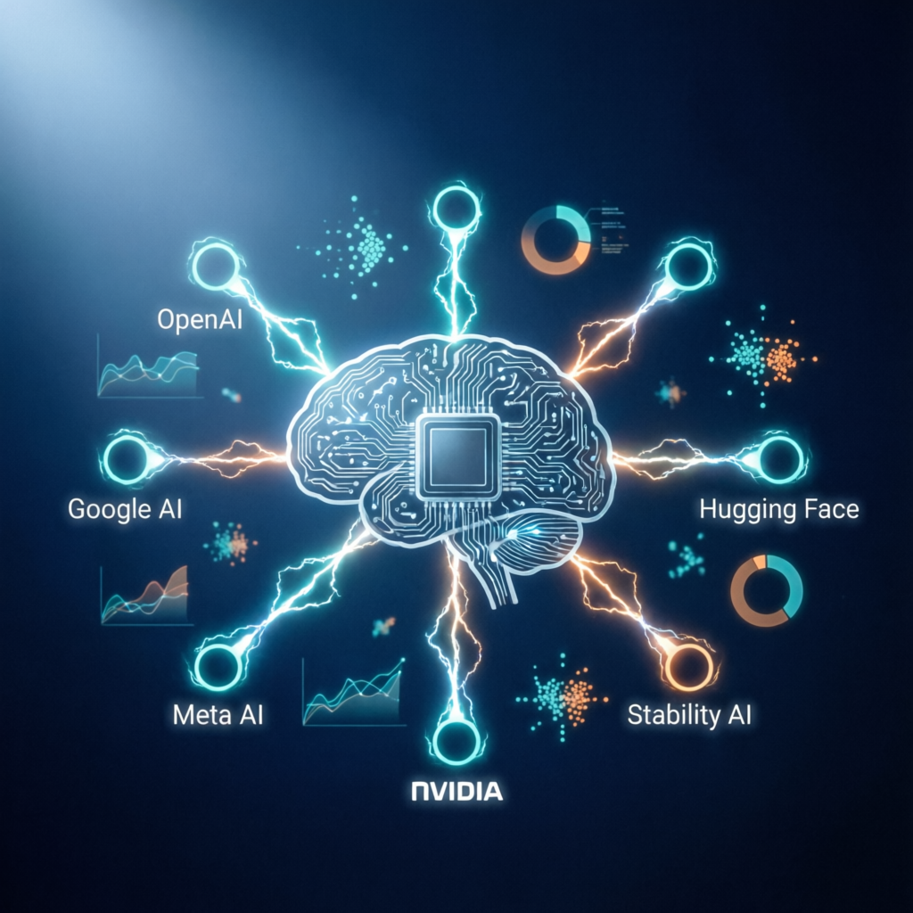

# 最近一周AI大事回顾：DeepSeek引爆全球、ChatGPT用户突破4亿、AI Agent时代来临

> **发布时间**：2025年1月
> **阅读时间**：约8分钟

## 引言：AI行业正经历前所未有的变革

过去一周，AI领域迎来了多个里程碑式的事件。从中国初创公司DeepSeek以极低成本挑战OpenAI的行业地位，到ChatGPT用户规模突破4亿大关，再到AI Agent从概念走向实践——这些事件正在重新定义我们与技术的关系。

如果你关注AI行业，这一周的信息密度足以改变你对整个领域的认知。

---

## DeepSeek R1：低成本训练挑战行业巨头

中国AI初创公司深度求索（DeepSeek）在本周成为全球科技圈焦点。其即将发布的推理模型R1，在多项基准测试中展现出与OpenAI o1相媲美的性能，但训练成本仅约560万美元——远低于竞争对手数亿美元的投入。

### 为什么这件事重要？

DeepSeek的出现打破了"AI竞赛需要天量算力"的固有认知。它证明了：

- **开源模型可以达到闭源模型的水平**：R1在数学推理、代码生成、科学推理等基准上超越OpenAI o1
- **低成本训练是可行的**：560万美元 vs 数亿美元，效率差距令人震惊
- **中国AI正在全球舞台崛起**：不再是追随者，而是创新引领者

这一事件直接引发了NVIDIA股价暴跌17%，因为市场开始质疑：如果训练成本可以大幅降低，那么对高端GPU的疯狂需求是否可持续？

---

## ChatGPT周活突破4亿：AI进入主流大众市场

OpenAI宣布ChatGPT的全球周活跃用户数已突破4亿大关。这个数字意味着什么？

**AI聊天机器人正式进入了与主流社交媒体应用相当的用户规模时代。**

更值得关注的是用户行为的变化：

- 18-24岁美国年轻人中，超过三分之一在使用ChatGPT
- 年轻用户将其当作"操作系统"使用，而非简单的搜索工具
- OpenAI CEO Sam Altman表示："Z世代和千禧一代正在把ChatGPT当作'人生顾问'使用。"

这表明AI不再只是技术爱好者的玩具，而是成为了日常生活中不可或缺的工具。

---

## OpenAI o3-mini：推理能力走向平民化

本周多家媒体报道，OpenAI正在筹备o3-mini模型——这是其旗舰级推理模型o3的轻量级、低成本版本。

o3-mini的核心价值在于：**降低高级推理能力的获取门槛**。

| 特性 | 说明 |
|------|------|
| 目标用户 | 开发者和企业用户 |
| 优势 | 更快的速度、更低的推理成本 |
| 能力 | 强大的逻辑推理和数学计算 |

这标志着AI推理能力正在从"高端专属"向"大众可用"转变。对于开发者而言，这意味着你可以以合理的成本，在自己的应用中集成前沿的AI推理能力。

---

## Google Gemini 2.0：原生多模态架构的范式转变

Google在2024年12月发布的Gemini 2.0 Flash正在持续扩展应用场景。到本周，Google已将其集成到Google Assistant、Google Search和Android系统中。

**Gemini 2.0的核心创新是什么？**

是"原生多模态"架构——模型从训练之初就同时处理文本、图像、音频和视频，而非通过后期拼接不同模块。

这种设计带来了两个关键优势：

1. **更低的延迟**：适合实时交互场景，如语音助手
2. **更好的跨模态理解**：模型能真正"理解"不同模态之间的关系

Google正在努力缩小与OpenAI在聊天机器人用户数量上的差距，而Gemini 2.0就是其最重要的武器。

---

## AI Agent：从"回答问题"到"完成任务"

2025年1月，AI Agent（能够自主规划、执行多步骤任务的AI系统）从研究概念快速转变为实际产品。

Google推出的**Project Mariner**是一个典型案例：

- 能够在网络上自主执行复杂任务
- 可以帮用户完成网页浏览、预订酒店、整理邮件等操作
- 代表了"浏览器 + AI"的新可能性

**这标志着AI交互范式的重大转变：从被动对话式到主动行动式。**

想象一下：你不再需要一步步教AI怎么做，而是告诉它你的目标，它自己去规划并执行。这正是AI Agent带来的变革。

---

## AI基础设施投资：效率提升vs算力需求

一个有趣的矛盾正在出现：

**一方面**，DeepSeek证明了用更少算力也能训练出好模型。

**另一方面**，大规模部署AI服务所需的推理算力需求仍在爆发式增长。

微软、Meta、Google等科技巨头仍在持续加大对AI基础设施的巨额投资。数十亿美元的数据中心建设计划不断公布。

这说明什么？训练效率的提升无法抵消用户规模爆炸带来的推理需求增长。AI基础设施竞赛远未结束。

---

## 版权与监管：AI发展的新挑战

本周还有一个不容忽视的趋势：全球AI安全与监管讨论持续升温。

- 多家出版商起诉Meta侵犯版权
- 开源模型的安全风险成为国际社会关注的焦点
- 各国政府正在加速制定AI相关法规

随着AI能力越来越强，如何平衡创新发展与风险控制，将成为行业必须面对的核心问题。

---

## 总结与展望

回顾这一周，我们可以看到几个清晰的趋势：

1. **AI正在变得更加普及**：ChatGPT 4亿用户、o3-mini降低门槛
2. **开源模型正在缩小与闭源的差距**：DeepSeek R1是最有力的证明
3. **AI Agent将改变我们与技术交互的方式**：从对话到行动
4. **基础设施竞赛远未结束**：推理需求仍在爆发式增长

**接下来值得关注什么？**

- DeepSeek R1正式发布后的市场反应
- OpenAI o3-mini的实际表现
- AI Agent产品能否真正落地并产生商业价值
- 全球AI监管政策的进展

AI行业正在以惊人的速度演进。保持关注，保持学习，才能在这个快速变化的时代抓住机会。

---

*本文基于公开报道整理，信息来源包括TechCrunch、Forbes、The Verge、Ars Technica等主流科技媒体。*
